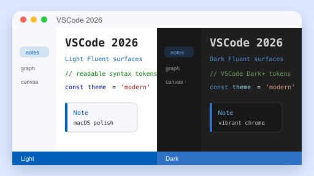

# VSCode 2026 — Obsidian Theme

> A faithful port of Microsoft Visual Studio 2026's Fluent visual language to Obsidian, with first-class macOS vibrancy support.



## Features

- **Light & Dark mode** — both first-class, follows system color scheme
- **VS 2026 Fluent UI tokens** — `#005FB8` / `#2F72C4` accent, `#F6F8FC` / `#DDE7FF` Light surfaces, `#1F1F1F` / `#181818` Dark surfaces
- **Complete VSCode Dark+ / Light+ syntax highlighting** — keyword / string / comment / function / variable / type / number / control / regex, double-mapped for both CodeMirror 6 (editor) and Prism.js (reading view)
- **macOS Tahoe-style polish** — SF Pro / SF Mono system font stack, 8–12 px rounded corners, defocused-window dim, `prefers-reduced-motion` support
- **Vibrancy / translucency** — sidebar, status bar, command palette and modals get `backdrop-filter` blur when *Translucent window* is enabled
- **Overlay scrollbars** — hidden by default, fade in on hover, macOS-style
- **All third-party UI themed via CSS variables** — callouts (13 types), graph view, canvas, calendar, dataview — no hardcoded colors

## Screenshot


## Installation

### From Community Themes (recommended, after marketplace approval)
1. *Settings* → *Appearance* → *Themes* → *Manage*
2. Search **VSCode 2026**
3. *Install* → *Use*

### Manual
1. Download `manifest.json` and `theme.css` from the latest [Release](../../releases/latest).
2. Place them in `<vault>/.obsidian/themes/VSCode 2026/`.
3. *Settings* → *Appearance* → *Themes* → choose **VSCode 2026**.

## Recommended Settings (macOS)

- *Settings* → *Appearance* → enable **Translucent window** to activate vibrancy.
- *Settings* → *Appearance* → set **Base color scheme** to **Adapt to system** so the theme follows your system Light/Dark setting.
- Minimum Obsidian version: **1.5.0** (uses `color-mix()`, requires Chromium 111+).

## Customization

Every color is a CSS variable. Override in a snippet:

```css
/* .obsidian/snippets/my-tweaks.css */
.theme-dark {
  --interactive-accent: #4EC9B0;       /* swap accent to teal */
  --code-keyword:       #C586C0;       /* purple keywords */
}
.theme-light {
  --background-primary: #FAFBFD;
}
```

Common variables to tweak:

| Variable | Purpose |
| --- | --- |
| `--interactive-accent` | Primary accent color (links, active tab top border, status bar) |
| `--background-primary` / `--background-secondary` | Editor and sidebar backgrounds |
| `--code-{keyword,string,comment,function,variable,type,number,control}` | Syntax highlight tokens |
| `--callout-{note,tip,info,success,question,warning,failure,error,bug,example,quote,abstract,todo}` | Callout colors (RGB triplets) |
| `--radius-{s,m,l,xl}` | Corner radii (default: 6 / 8 / 12 / 16 px) |
| `--vibrancy-blur` / `--vibrancy-saturation` | macOS vibrancy strength |

## Credits

- Microsoft Visual Studio 2026 Fluent design tokens — [DevBlogs 2026/06/15](https://devblogs.microsoft.com/visualstudio/make-visual-studio-look-the-way-you-want/)
- VSCode Dark+ / Light+ syntax color palette — [microsoft/vscode](https://github.com/microsoft/vscode/tree/main/extensions/theme-defaults/themes)
- Inspired by [leozague/obsidian-vscode-dark-plus](https://github.com/leozague/obsidian-vscode-dark-plus) — built independently from scratch, no code reused.

## License

MIT — see [LICENSE](LICENSE).
